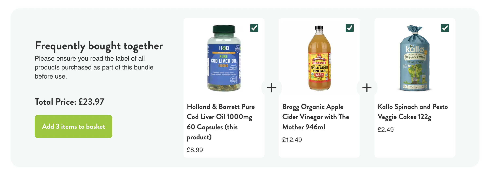

# H&B Bundles / React Component Test

Please don't spend more than a few hours on this test, we can talk through where you got up to as part of any interview. Be prepared to talk through what you would have done given more time.

## Setup

1. `npm install`
2. `npm run storybook`

## The Task

Create a react component in storybook for the bundles component

### Bundles Component

Fetch data from the endpoint `https://hb.demo/products` (The data is mocked in the file Bundles.stories.tsx)

### A/C's

1. The 'total price' should update when products are selected.
2. The button text should reflect the number of selected products.
3. Should closely match the design.
4. Should only show products that are in stock.
5. Console.log the SKUs of the products to add to the basket when clicking the button.

### Food for thought

1. Performance / Suspense
2. Scenarios where the API is offline
3. Testing / TDD
